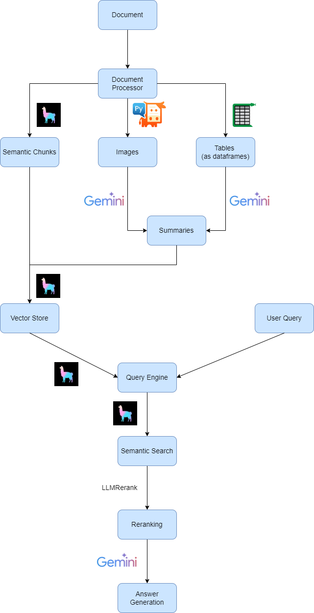
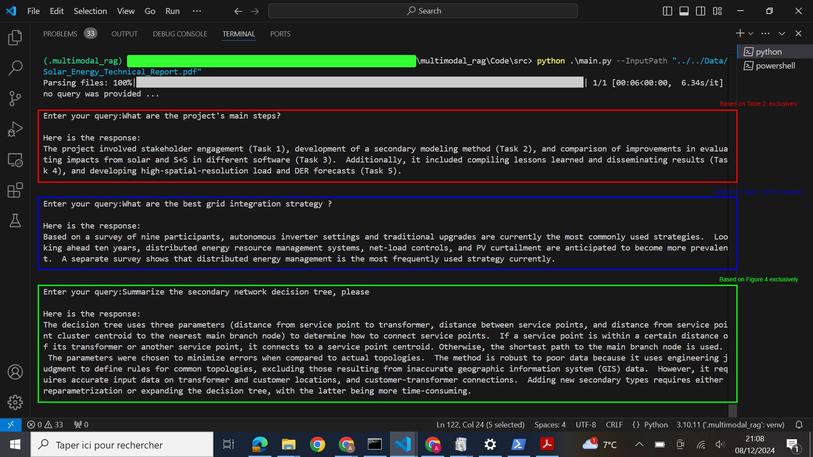

# Multimodal Semantic RAG

### Table of contents
* [Overview](###Overview)
* [Features](###Features)
* [Installation](###Installation)
* [Workflow](###Workflow)
* [Usage](###Usage)
* [Demo](###Demo)
* [Perspectives](###Perspectives)

### Overview

Retrieval-Augmented Generation (RAG) is an AI framework that combines the retrieval capabilities of information retrieval systems (mainly encoders & Vector DBs) with the generative abilities of large language models (LLMs). 
External knowledge sources (User Documents) are used to provide accurate, context-aware answers and generate factual responses

A RAG application has exponentially higher utility if it can work with a wide variety of data types: tables, graphs, charts, etc. and not just text. 
This requires a framework that can understand and generate responses by coherently interpreting textual, visual and tabular forms of information.
To tackle this problem, this repo aims to create a Multimodal Semantic RAG system.

### Features
- Semantic chunking: \
With LlamaIndex's SemanticSplitterNodeParser, split documents into semantically coherent, meaningful chunks.
- Image and table detection: \
Detecting images and tables using PyMuPDF and Camelot respectively.
- Summarizing images and tables: \
Using a multimodal LLM (eg. gemini-1.5-flash), create a text description of each image and each table (tables transformed to dataframes, then fed to the LLM in HTML format.
- Embedding: \
Embed chunks, images and tables summaries using "text-embedding-004" model.
- Semantic Retrieval: \
Achieved using LlamaIndex's RetrieverQueryEngine
- ReRanking: \
Achieved using LlamaIndex's LLMRerank, that provides LLM-based reranker.
- Answer generation: \
Using the retrieved and ranked chunks, a Gemini LLM will generate an answer to the query. \
<br />More details are given in the workflow section

### Installation
To run the app locally, the following steps are necessary:
- Clone The repo:
```bash
git clone https://github.com/AhmedAl93/multimodal-semantic-RAG.git
cd multimodal-semantic-RAG/
```
- Install the required python packages:
```bash
pip install -r requirements.txt
```
- Set up the environment variables in the .env file:
```bash
LLAMA_CLOUD_API_KEY=<Your LLAMACLOUD API KEY>
GOOGLE_API_KEY=<Your Google API KEY>
```

### Workflow
The current workflow is as follows:
<p align="center">

</p>
This workflow may evolve to include additional steps, support a wider range of AI platforms and providers, or introduce entirely new concepts (e.g., GraphRAG, AgenticRAG). For more details, refer to the ###Perspectives section.

### Usage
1. Process input document(s):

Run the following command:
```bash
python .\main.py --InputPath <your document directory path, or single file path >
```
Currently, only PDF files are supported. So if the input directory contains x PDFs, x files will be processed.

2. Provide queries:

In the terminal, you can provide multiple queries and get relevant answers


### Demo
The file data/input/Solar_Energy_Technical_Report.pdf was provided as the input document.
In this demo, each query is designed to target a specific modality, meaning the answer resides exclusively within a paragraph, an image, or a table in the document.
Here is a set of queries/answers:
<p align="center">

</p>

### Perspectives
In the near future, I plan to work on the following features:
- Support other file types than PDF
- Retrieval Performance Evaluation
- Support open-source LLMs
- Support other Vector DBs providers
- Support different rerankers, from diverse AI platforms (Cohere, Jina, ...)
- Assess and test new concepts: GraphRAG, AgenticRAG, ... 
- Cloud deployment